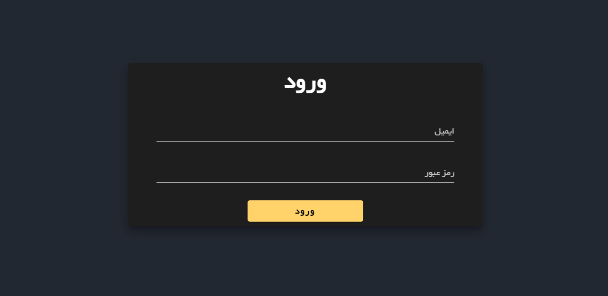
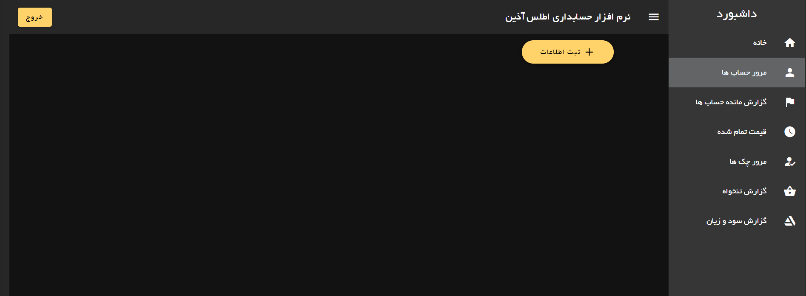
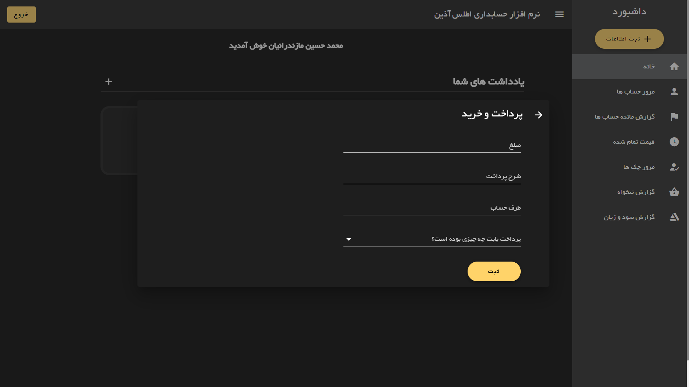

# Atlas Accounting Dashboard

## Try it

https://modos.github.io/Accounting-Dashboard/

email : atlas@gmail.com
<br>
password : atlasdemo

<hr>

## Features

🔸Vue
🔸Veutfiy
🔸Veux
🔸Firebase
🔸Local Storage
🔸Unit Testing with Jest

<hr>

## Last Commit Changes

✔ Unit Testing for components, views and functions with Jest
<br>

✔ Fixing Router Navigation Redunant error & some naming bugs
<br>


<hr>

## Screenshots





<hr>

## Project setup
```
npm install
```

### Compiles and hot-reloads for development
```
npm run serve
```

### Compiles and minifies for production
```
npm run build
```

### Customize configuration
See [Configuration Reference](https://cli.vuejs.org/config/).
