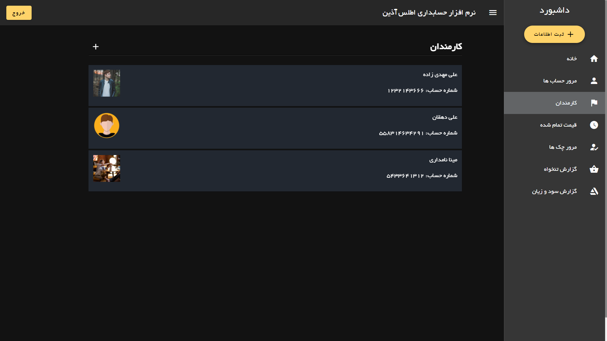

# atlas

## Try it

https://modos.github.io/Accounting-Dashboard/

email : atlas@gmail.com,
password : atlasdemo

## Features

🔸Vue
🔸Veutfiy
🔸Veux
🔸Firebase

## Screenshots





## Project setup
```
npm install
```

### Compiles and hot-reloads for development
```
npm run serve
```

### Compiles and minifies for production
```
npm run build
```

### Customize configuration
See [Configuration Reference](https://cli.vuejs.org/config/).
