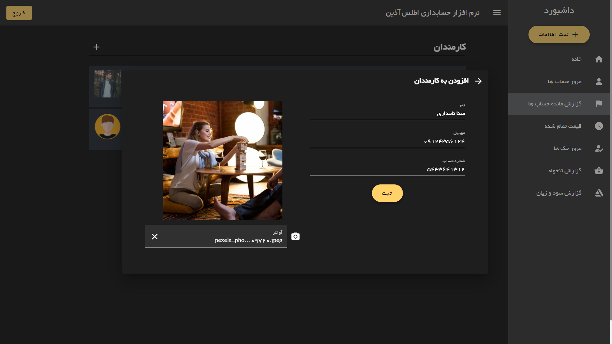
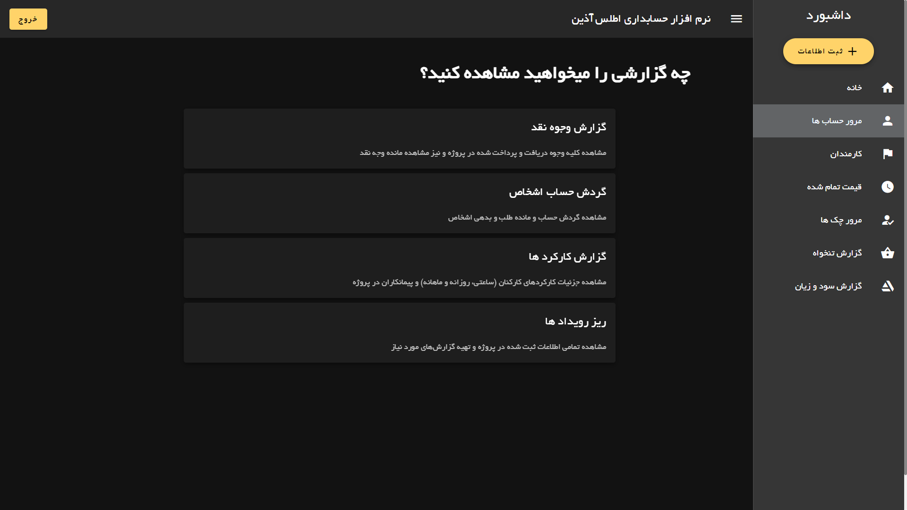

# Atlas Accounting Dashboard

## Try it

https://modos.github.io/Accounting-Dashboard/

email : atlas@gmail.com
<br>
password : atlasdemo

<hr>

## Features

🔸Vue
🔸Veutfiy
🔸Veux
🔸Firebase
🔸Local Storage

<hr>

## Last Commit Changes

✔ Adding Local Storage for Saving User's Data
<br>

✔ Fixing Some UI Bugs
<br>

✔ Refactoring
<br>

✔ Customize Scroll Bar
<br>

✔ New Feature: Daily Notes
<br>

✔ New Page: Account Review


<hr>

## Screenshots





<hr>

## Project setup
```
npm install
```

### Compiles and hot-reloads for development
```
npm run serve
```

### Compiles and minifies for production
```
npm run build
```

### Customize configuration
See [Configuration Reference](https://cli.vuejs.org/config/).
